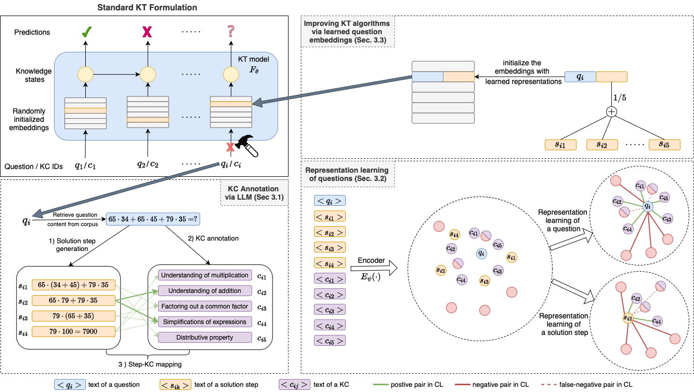

# Automatic Skill Extraction and Question Representation Learning for Knowledge Tracing

## Setup
 
 We used XES3G5M and EEDI datsets for our work. 
 - The details of XES3G5M can be founder [here](https://github.com/ai4ed/XES3G5M). You can download the dataset by following instructions there. After the download, You can add the files from [data/XES3G5M/metadata](data/XES3G5M/metadata) to run our framework. 
 - [EEDI](https://eedi.com) dataset can be acquired upon request 

 We used Python 3.11.6 in our implementation. We use two separate virtual environments in our framework. 

 - Install the libraries via `pip install -r requirements_env_rl.txt` for [KC Annotation](#1-kc-annotation-via-llms) and [Representation Learning](#2-representation-learning-of-questions)

 - Install the libraries via `pip install -r requirements_env_rl.txt` for [Improving KT algorithms](#3-improving-kt-algorithms). After loading libraries, locate [pykt-toolkit](pykt-toolkit) and run the command `pip install -e .` to install our custom version of pykt with improved kt implementations. 

 ## 1) KC Annotation via LLMs

 This part shows an example usage of full KC annotation pipeline. To run the scripts, first locate [kc_annotation](kc_annotation) folder
 
We use the English translation of XES3G5M dataset [`questions_translated.json`](data/XES3G5M/metadata/questions_translated.json) as our running example. 

### a) Solution step generation 

You can run the command below

`python get_mapping_kc_solsteps.py --original_question_file ../data/XES3G5M/metadata/questions_translated.json --annotated_question_file ../data/XES3G5M/metadata/questions_translated_kc_annotated.json`

### b) KC annotation

You can run the command below

`python get_kc_annotation.py --original_question_file ../data/XES3G5M/metadata/questions_translated_kc_annotated.json --annotated_question_file ../data/XES3G5M/metadata/questions_translated_kc_sol_annotated.json`

### c) Solution Step - KC mapping

You can run the command below

`python get_mapping_kc_solsteps.py --original_question_file ../data/XES3G5M/metadata/questions_translated_kc_sol_annotated.json --mapped_question_file ../data/XES3G5M/metadata/questions_translated_kc_sol_annotated_mapped.json`

**Note:** For convenience, we provide the final output of this pipeline  [questions_translated_kc_sol_annotated_mapped.json](../data/XES3G5M/metadata/questions_translated_kc_sol_annotated_mapped.json).

## 2) Representation Learning of Questions

For this part, please locate [representation_learning](representation_learning) folder.

For training, you can run the command below:

`python train.py --json_file_dataset ../data/XES3G5M/metadata/questions_translated_kc_sol_annotated_mapped.json --json_file_cluster_kc data/XES3G5M/metadata/kc_clusters_hdbscan.json --json_file_kc_questions data/XES3G5M/metadata/kc_questions_map.json --wandb_project_name <your_wandb_project_name>`

Note that the above command requires you to setup your wandb account first. 

After training, you can save the embeddings by following [save_embeddings.ipynb](representation_learning/save_embeddings.ipynb). 

## 3) Improving KT Algorithms

We implemented the improved versions of KT algorithms via [pykt](https://github.com/pykt-team/pykt-toolkit) library. We forked the library to [pykt-toolkit](pykt-toolkit) and developed the algorithsm there. Specifically, our implemented KT algorithms can be found in [models](pykt-toolkit/pykt/models) folder. 

As the naming convention, we added `Que` suffix to the existing algorithms, where "que" refers to our question embeddings. For instance, the improved version of `SimpleKT` is implemented as `SimpleKTQue` and can be found in [simplekt_que.py](pykt-toolkit/pykt/models/simplekt_que.py). 

For training the these models, you can locate [train_test](pykt-toolkit/train_test) folder. You can train `SimpleKTQue` with the command below: 

`python sparsekt_que_train.py --emb_path <embeddings_from_representation_learning>`

Note that the above command requires you to setup your wandb account first. 

We use `wandb_eval.py` and `wandb_predict.py` from pykt library for evaluation. The details of the library can be found in their [documentation](https://pykt-toolkit.readthedocs.io/en/latest/).